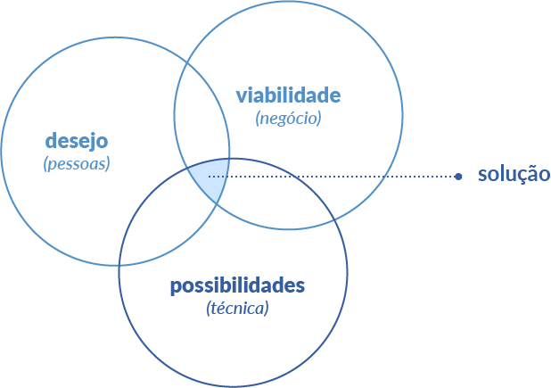

# Design Thinking na Prática: Um Estudo Aplicado

*Este documento é uma consolidação dos estudos realizados como parte do meu Plano de Desenvolvimento Individual (PDI), culminando em um workshop sobre Design Thinking aplicado ao desenvolvimento de software.*

---

## Índice

- [Design Thinking na Prática: Um Estudo Aplicado](#design-thinking-na-prática-um-estudo-aplicado)
  - [Índice](#índice)
  - [1. Introdução: o que é Design Thinking?](#1-introdução-o-que-é-design-thinking)
    - [O papel fundamental da Stanford d.school](#o-papel-fundamental-da-stanford-dschool)
  - [2. Desvendando o caminho: pilares e processo](#2-desvendando-o-caminho-pilares-e-processo)
    - [As três lentes da inovação](#as-três-lentes-da-inovação)
    - [Princípios e Pilares Fundamentais](#princípios-e-pilares-fundamentais)
    - [As 5 etapas do modelo d.school](#as-5-etapas-do-modelo-dschool)
  - [3. Design Thinking no desenvolvimento de software](#3-design-thinking-no-desenvolvimento-de-software)
    - [O design invisível: do visual ao motor](#o-design-invisível-do-visual-ao-motor)
    - [Da implementação ao impacto: entregar software vs. entregar valor](#da-implementação-ao-impacto-entregar-software-vs-entregar-valor)
  - [4. Estudos de caso: aprendendo com a prática](#4-estudos-de-caso-aprendendo-com-a-prática)
    - [Fracasso: Healthcare.gov (EUA, 2013)](#fracasso-healthcaregov-eua-2013)
    - [Sucesso: Netflix Global e a Engenharia do Caos](#sucesso-netflix-global-e-a-engenharia-do-caos)
  - [5. Ferramentas](#5-ferramentas)
  - [6. Considerações Finais](#6-considerações-finais)
  - [7. Referências completas](#7-referências-completas)
    - [Conceitos gerais](#conceitos-gerais)
    - [Estudos de caso](#estudos-de-caso)

---

## 1. Introdução: o que é Design Thinking?

O Design Thinking é uma abordagem criativa e centrada no ser humano para a **solução de problemas complexos**. Mais do que uma metodologia, é um mindset que propõe uma **nova forma de pensar processos, experiências e modelos de negócios**, com foco em gerar mudanças e valor real para as pessoas. A ideia é ir além da necessidade de criar um produto, buscando entender e até mesmo ditar comportamentos e necessidades futuras dos usuários.

Embora o termo tenha se popularizado recentemente, suas raízes são acadêmicas e multidisciplinares:
-   **Anos 50-60**: Engenheiros e acadêmicos como John E. Arnold e L. Bruce Archer iniciaram estudos sobre **processos criativos e métodos sistemáticos no design**.
-   **1969**: O cientista político e economista Herbert A. Simon, em sua obra seminal *"The Sciences of the Artificial"*, descreveu o **design como uma atividade focada na resolução de problemas**.
-   **1990**: Os irmãos David e Tom Kelley fundaram a **IDEO**, a consultoria de inovação que foi crucial para levar o DT do **campo acadêmico para o mundo dos negócios**.
-   **Anos 2000**: Tim Brown, CEO da IDEO, com o livro *"Change by Design"*, consolidou o DT como uma **abordagem estratégica para a inovação**.

### O papel fundamental da Stanford d.school

No centro da popularização e da estruturação do Design Thinking moderno está o **Hasso Plattner Institute of Design at Stanford**, mundialmente conhecido como **d.school**. Fundada por David Kelley, da IDEO, a d.school não é uma escola de design tradicional, mas um hub de inovação dentro da Universidade de Stanford, criado para ensinar a mentalidade do design para estudantes de todas as áreas — engenharia, medicina, negócios, direito, etc.

Sua importância é imensa por duas razões principais:

1.  **Estruturação do processo**: Foi a d.school que consolidou e popularizou o famoso **modelo de 5 etapas (Empatia, Definição, Ideação, Prototipagem e Teste)**, que hoje serve como a principal referência para a aplicação prática do Design Thinking em todo o mundo.
2.  **Disseminação do conhecimento**: Ao focar no ensino e na aplicação prática através de projetos reais, a d.school se tornou o principal catalisador para a disseminação global da abordagem, formando líderes e inovadores que levaram essa filosofia de trabalho para as maiores empresas de tecnologia e para os mais diversos setores do mercado.

Portanto, ao estudar Design Thinking hoje, estamos, em grande parte, estudando o legado e a metodologia refinada e ensinada pela Stanford d.school.

---

## 2. Desvendando o caminho: pilares e processo

### As três lentes da inovação

Toda solução verdadeiramente inovadora existe na intersecção de três critérios essenciais. A verdadeira inovação mora nesse equilíbrio, onde a **solução ideal** é encontrada.

1.  **Desejabilidade (pessoas)**: A solução resolve uma dor real e faz sentido para os usuários? Ela atende às suas necessidades, desejos e expectativas?
2.  **Possibilidades (técnica / praticidade)**: É tecnicamente viável construir e manter a solução com os recursos e tecnologias que temos disponíveis? É funcional em um futuro próximo?
3.  **Viabilidade (negócio)**: O modelo de negócio por trás da solução é financeiramente sustentável a longo prazo?

### Princípios e Pilares Fundamentais

Quatro pilares sustentam a prática do Design Thinking, moldando a mentalidade necessária para inovar:

-   **Empatia**: A capacidade de se colocar no lugar do outro para entender profundamente seus sentimentos, comportamentos e desejos. É o que permite traduzir observações em insights que podem melhorar a vida das pessoas.
-   **Colaboração**: O trabalho conjunto de equipes multidisciplinares para trazer diferentes perspectivas para a mesa, enriquecendo a busca por soluções.
-   **Prototipagem**: A prática de transformar ideias abstratas em modelos tangíveis e de baixo custo (sejam eles físicos ou digitais) para que possam ser testados, criticados e aprimorados, concretizando ideias para que outros possam contribuir.
-   **Experimentação**: Uma mentalidade de criar, testar, aprender com os erros e iterar rapidamente. Como disse Linus Pauling, "para ter uma boa ideia, você antes precisa ter muitas ideias". É preciso arriscar para descobrir caminhos inusitados.

### As 5 etapas do modelo d.school

O processo é dividido em cinco fases principais que não são lineares, mas sim iterativas, podendo se repetir ao longo do projeto:

1.  **Empatia (imersão)**: Mergulhar no universo do usuário para entender suas dores, necessidades e expectativas. O objetivo é trocar suposições por insights reais, muitas vezes através de entrevistas, observação e outras técnicas de pesquisa.
2.  **Definição (análise e síntese)**: Sintetizar os aprendizados da fase anterior para formular um problema claro e bem definido, identificando padrões e categorizando as ideias. O foco aqui é garantir que estamos resolvendo o desafio correto.
3.  **Ideação**: Gerar o maior volume possível de ideias e soluções, sem julgamentos iniciais. Esta etapa valoriza a criatividade livre e o pensamento "fora da caixa", com a equipe tendo liberdade para experimentar e errar, pois o medo da falha inibe a inovação.
4.  **Prototipagem**: Construir versões simplificadas e de baixo custo da solução (wireframes, mockups, storyboards, MVPs). O objetivo é ter algo concreto para obter feedback rápido e validar hipóteses na prática, sentindo como a solução se comporta.
5.  **Testes**: Validar os protótipos com usuários reais para coletar feedback e identificar pontos de melhoria, refinando a solução antes da implementação final.

---

## 3. Design Thinking no desenvolvimento de software

### O design invisível: do visual ao motor

É um erro comum pensar que "design" se aplica apenas à interface (front-end) — cores, tipografia, disposição de telas. O Design Thinking deve permear todas as camadas de um produto, incluindo sua arquitetura e infraestrutura.

-   **Front-end (o visível)**: Onde se prototipam fluxos e se realizam testes de usabilidade para criar interfaces intuitivas, acessíveis e agradáveis.
-   **Back-end (o invisível)**: O usuário final não vê o esqueleto do sistema, mas sente profundamente seus efeitos. Performance, tempo de resposta, confiabilidade, escalabilidade e segurança são aspectos de "design" cruciais para a experiência do usuário.

De nada adianta uma interface bonita se o sistema demora a carregar ou falha em situações críticas. Da mesma forma, uma arquitetura robusta que ignora o fluxo mental do usuário não gera valor. O verdadeiro impacto está no **alinhamento** entre a **experiência estética** e a **experiência funcional**.

### Da implementação ao impacto: entregar software vs. entregar valor

No contexto de tecnologia, a aplicação do Design Thinking nos leva a uma reflexão crucial:

-   **Entregar software**: É o ato de disponibilizar funcionalidades, código e recursos técnicos. É cumprir o que foi solicitado. A pergunta respondida é: *"Isso foi implementado?"*.
-   **Entregar valor**: É garantir que essas funcionalidades resolvem dores reais, simplificam a vida do usuário e geram um impacto positivo e perceptível. A pergunta respondida é: *"Isso faz sentido para o usuário?"*.

A qualidade de software — código limpo, performance, testes — é a base inegociável que sustenta a entrega de valor a longo prazo. No entanto, essa base precisa sustentar algo que as pessoas queiram usar. Como na analogia de um carro de alta performance: o motor pode ser uma obra de arte da engenharia, mas se o volante for quadrado e o banco desconfortável, o valor entregue ao motorista é quase nulo.

O verdadeiro profissional 'full stack' domina duas pilhas de conhecimento: a **pilha técnica (o COMO construímos)** e a **pilha de empatia (o PORQUÊ construímos)**. Não adianta ter um 'COMO' brilhante para um 'PORQUÊ' que não existe.

---

## 4. Estudos de caso: aprendendo com a prática

A aplicação (ou a falta dela) dos princípios do Design Thinking tem consequências diretas no sucesso de um produto. Analisar casos reais, tanto de fracasso quanto de sucesso, nos ajuda a entender o impacto tangível de colocar o usuário e a resiliência do sistema no centro do desenvolvimento.

### Fracasso: Healthcare.gov (EUA, 2013)

-   **O cenário**: O portal Healthcare.gov foi lançado como a peça central do *Affordable Care Act* (“Obamacare”), uma iniciativa de altíssima visibilidade política e social. A expectativa era de que milhões de cidadãos americanos acessassem a plataforma para se cadastrar em planos de saúde logo em seu lançamento.

-   **O que deu errado? O design invisível ignorado**: O projeto focou em entregar uma interface que, superficialmente, parecia funcional ("falsas aparências"). No entanto, o "motor" por trás era um desastre. Os principais problemas não eram visuais, mas de arquitetura e processo:
    -   **Falhas críticas de integração**: A comunicação entre os múltiplos sistemas de agências governamentais e seguradoras era mal coordenada, levando a erros constantes.
    -   **Testes de carga insuficientes**: A infraestrutura de back-end não foi devidamente testada para suportar a carga de acessos esperada, resultando em um sistema lento que travava constantemente, impedindo que os usuários completassem o cadastro.

-   **As consequências**: O resultado foi um fracasso catastrófico que transcendeu a tecnologia, tornando-se uma crise de confiança pública.
    -   Nos primeiros dias, **apenas 6 pessoas** conseguiram concluir o cadastro com sucesso.
    -   O custo inicial, estimado em **US$ 93 milhões**, explodiu para mais de **US$ 1,7 bilhão** após as inúmeras correções e reconstruções parciais necessárias para tornar o sistema minimamente funcional.
    -   **Aprendizado principal**: Este caso é um exemplo clássico de foco na "entrega de software" em detrimento da "entrega de valor". A equipe implementou as funcionalidades, mas ignorou a experiência real do usuário, que dependia diretamente da performance e confiabilidade do back-end.

### Sucesso: Netflix Global e a Engenharia do Caos

-   **O desafio**: Ao migrar de um serviço de entrega de DVDs para o streaming global, a Netflix enfrentou um desafio monumental: como garantir um serviço resiliente e com uma experiência consistente para milhões de usuários em diversos países e condições de rede. A falha não era uma opção.

-   **A solução? Um design de back-end radical**: Em vez de apenas tentar *prevenir* falhas, a Netflix adotou a mentalidade de que **as falhas são inevitáveis**. Com base nisso, eles criaram uma disciplina inteira chamada **Engenharia do Caos**, cuja principal ferramenta é o famoso **Chaos Monkey**.

-   **O que é o Chaos Monkey?**: É uma ferramenta que deliberadamente desliga servidores **em produção** e durante o horário comercial. A ideia é simples: se você sabe que um "macaco" pode entrar no seu data center a qualquer momento e arrancar um cabo da tomada, você é forçado a projetar um sistema que continue funcionando perfeitamente mesmo sem aquele servidor. Isso obriga os desenvolvedores a construir redundância e mecanismos de recuperação automática em tudo o que fazem.

-   **A evolução: O "Exército de Macacos" (Simian Army)**: O Chaos Monkey foi tão eficaz que a Netflix expandiu o conceito para um conjunto de ferramentas, o **Simian Army**, onde cada "macaco" é especializado em causar um tipo diferente de caos para testar a resiliência do sistema de ponta a ponta:
    -   **Latency Monkey**: Introduz atrasos artificiais na comunicação entre os serviços para garantir que o sistema saiba lidar com lentidão na rede sem quebrar.
    -   **Chaos Gorilla**: É um Chaos Monkey muito mais poderoso. Ele simula a falha de uma "zona de disponibilidade" inteira da Amazon (o equivalente a um data center completo).
    -   **Janitor Monkey**: Procura por recursos na nuvem que não estão sendo usados (instâncias "esquecidas", volumes de disco órfãos) e os "limpa", garantindo eficiência e redução de custos.

-   **Impacto para o usuário**: O resultado dessa abordagem focada no "design invisível" do motor é um valor extremamente perceptível e que define a marca:
    -   O streaming **quase nunca cai**.
    -   Filmes e séries **carregam rápido**, mesmo em diferentes condições de rede.
    -   A **confiança do usuário** na marca cresce, porque a experiência é consistente e confiável.

---

## 5. Ferramentas

-   **Mapas de empatia**: Ferramenta visual para organizar o que o usuário **vê, ouve, pensa, sente, fala e faz**, respondendo a perguntas sobre seus sentimentos e ações.
-   **Shadowing**: Técnica de observar um usuário em seu contexto real, como uma "sombra", para capturar comportamentos que ele não conseguiria verbalizar.
-   **Brainstorming / Brainwriting**: Técnicas para geração de ideias em grupo, focadas em quantidade e criatividade livre, sem críticas ou julgamentos.
-   **World Café**: Metodologia de diálogo colaborativo em que grupos rotativos "polinizam" ideias entre si, enriquecendo a discussão sobre um problema determinado.
-   **Problem Statements**: Declarações que traduzem os desafios em uma frase clara e centrada no usuário, guiando a busca por soluções.
-   **SCAMPER**: Um acrônimo (**S**ubstituir, **C**ombinar, **A**daptar, **M**odificar, **P**ropor outros usos, **E**liminar, **R**everter) que funciona como um checklist para estimular a criatividade e gerar novas ideias a partir de algo existente.
-   **Mind Mapping**: Diagrama visual para organizar ideias e conceitos de forma ramificada, ajudando a enxergar conexões.
-   **Cocriação com o cliente**: Convidar clientes para participar do processo de criação (ideação e prototipagem) para gerar insights precisos.

---

## 6. Considerações Finais

O Design Thinking, em sua essência, não é uma receita de bolo ou um conjunto rígido de regras, mas sim uma **filosofia de trabalho**. É uma abordagem que nos convida a integrar empatia, colaboração, prototipagem e experimentação contínua em tudo o que fazemos. Ela nos ensina a enxergar os problemas não a partir da tecnologia, mas a partir das pessoas.

A verdadeira força desta abordagem está em sua capacidade de alinhar a **desejabilidade** humana com a **viabilidade** de negócio e as **possibilidades** técnicas, garantindo que as soluções criadas não sejam apenas inovadoras, mas também sustentáveis e relevantes.

Para nós, desenvolvedores, aplicar esta filosofia significa uma evolução fundamental em nosso papel. Saímos da posição de meros implementadores de requisitos para nos tornarmos verdadeiros solucionadores de problemas. A pergunta-chave deixa de ser "como podemos construir isso?" e passa a ser "por que estamos construindo isso e para quem?".

Em última análise, adotar o Design Thinking é se comprometer a não apenas entregar software, mas a entregar **valor real**.

---

## 7. Referências completas

### Conceitos gerais
-   [Design Thinking | Escola Digital PR](https://professor.escoladigital.pr.gov.br/design_thinking)
-   [Design Thinking: inovação pela criação de valor para o cliente | Sebrae](https://sebrae.com.br/sites/PortalSebrae/artigos/design-thinking-inovacao-pela-criacao-de-valor-para-o-cliente,c06e9889ce11a410VgnVCM1000003b74010aRCRD)
-   [Design Thinking: o que é, como aplicar e passo a passo | FIA](https://fia.com.br/blog/design-thinking/)
-   [What is Design Thinking? | Interaction Design Foundation](https://www.interaction-design.org/literature/topics/design-thinking)

### Estudos de caso
-   [How Design Thinking Transformed Airbnb From a Failing Startup to a Billion-Dollar Business | First Round Review](https://review.firstround.com/how-design-thinking-transformed-airbnb-from-failing-startup-to-billion-dollar-business)
-   [The Role of Design Thinking in Transforming Airbnb into a Soaring Success | MyGreatLearning](https://www.mygreatlearning.com/blog/the-role-of-design-thinking-in-transforming-airbnb-into-a-soaring-success/)
-   [The Failed Launch of www.healthcare.gov | Harvard Business School](https://d3.harvard.edu/platform-rctom/submission/the-failed-launch-of-www-healthcare-gov/)
-   [Healthcare.gov: Case Study of CMS's Management of the Federal Marketplace | OIG Report](https://oig.hhs.gov/reports/all/2016/healthcaregov-case-study-of-cms-management-of-the-federal-marketplace/)
-   [Case Study: The Launch Failure of Healthcare.gov | Henrico Dolfing](https://www.henricodolfing.com/2022/12/case-study-launch-failure-healthcare-gov.html)
-   [A Case Study on Snapchat's Redesign Failure and What We Can Learn | Onething Design](https://www.onething.design/post/snapchat-redesign-case-study)
-   [Snapchat's Failed Redesign | ICMR India](https://www.icmrindia.org/casestudies/catalogue/Marketing/Snapchat%20Failed%20Redesign-Excerpts.htm)
-   [Windows 8: An OS design mistake that cost Microsoft dearly | TechRepublic](https://www.techrepublic.com/article/windows-8-an-os-design-mistake/)
-   [The Netflix Simian Army | Netflix Tech Blog](https://netflixtechblog.com/the-netflix-simian-army-16e57fbab116)
-   [The Evolution of Chaos Monkey - 10 Years Later | Netflix Tech Blog](https://netflixtechblog.com/the-evolution-of-chaos-monkey-10-years-later-41421dceb4ba)
-   [Netflix's Chaos Monkey Released Into the Wild | InfoQ](https://www.infoq.com/news/2012/07/netflix-chaos-monkey/)